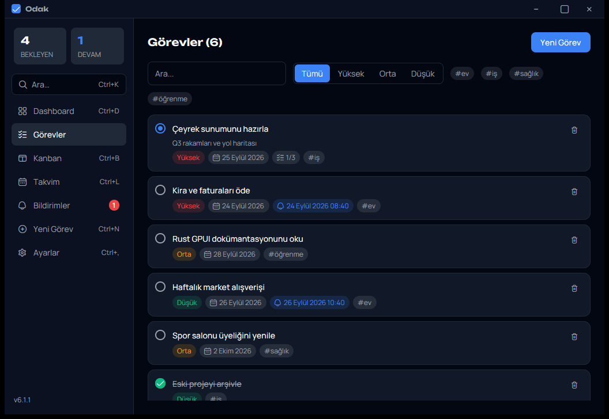

# Odak

Windows için hızlı bir görev yöneticisi. Rust ve Zed'in arayüz çatısı [GPUI](https://www.gpui.rs) ile yazıldı. Hesap gerektirmez: giriş yapmazsan görevlerin yalnızca kendi bilgisayarında kalır. İstersen Discord ile giriş yapıp görevlerini bilgisayarların arasında senkronize edebilirsin.



## Özellikler

- **Görevler:** öncelik, durum, son tarih, etiketler ve alt görevler. Arama, öncelik ve etiket filtreleri var; sıralamayı sürükle-bırakla değiştirebilirsin.
- **Kanban, takvim ve özet:** kartı sürükleyerek durumunu değiştir; son tarihleri takvimde gör; bekleyen ve geciken işleri tek ekranda takip et.
- **Hatırlatıcılar:** bir kez, günlük ya da haftalık. Ekranın köşesinde, yaptığın işi bölmeden (odağı çalmadan) görünür; tıklayınca ilgili görev açılır. Bilgisayar kapalıyken kaçırılanlar açılışta bir kez gösterilir.
- **Markdown açıklamalar:** önizlemeli yazım; kalın, italik, listeler, yapılacak kutuları, kod ve bağlantılar.
- **Ctrl+K:** görevlerde arama ve hızlı komutlar.
- **Hesap ve senkron (isteğe bağlı):** Discord ile giriş yapınca görevlerin hesabına kaydedilir ve giriş yaptığın her bilgisayarda aynı olur. İnternet yokken de çalışır; değişiklikler bağlantı gelince gönderilir.
- **Bildirim geçmişi**, koyu ve açık tema.
- **Sistem tepsisi:** pencereyi kapatınca tepside çalışmaya devam eder, istersen Windows ile birlikte açılır ve kendini otomatik günceller.

## İndir

[Son sürüm](https://github.com/seind-dev/Odak/releases/latest) sayfasından `seindtask-win-Setup.exe` dosyasını indirip çalıştır. Kurmadan denemek istersen `seindtask-win-Portable.zip` dosyasını açıp içindeki `Odak.exe`'yi çalıştır.

Yükleyici dijital olarak imzalı olmadığı için Windows SmartScreen uyarı gösterebilir: **Ek bilgi → Yine de çalıştır**.

Verilerin `%APPDATA%\seindtask\data.json` dosyasında durur. Giriş yaptıysan oturumun aynı klasördeki `session.bin` dosyasında, Windows hesabına özel şifrelenmiş olarak saklanır. Uygulamayı kapatmak için tepsi simgesine sağ tıklayıp **Çıkış**'ı seç.

## Kısayollar

| Kısayol | İşlev |
|---|---|
| Ctrl+K | Arama ve komutlar |
| Ctrl+N | Yeni görev |
| Ctrl+D | Dashboard |
| Ctrl+B | Kanban |
| Ctrl+L | Takvim |
| Ctrl+, | Ayarlar |

## Kaynak koddan derleme

Gerekenler: Windows ve [Rust](https://rustup.rs) (stable).

```bash
cargo run              # geliştirme sürümü
cargo test             # testler
cargo build --release  # target/release/seindtask.exe
```

İlk derleme GPUI'yi de derlediği için birkaç dakika sürer.

Hesap özellikleri bir [Supabase](https://supabase.com) projesi kullanır; şema `supabase/migrations` klasöründedir. Proje adresi ve yayınlanabilir anahtar derleme sırasında proje kökündeki `.env` dosyasından okunur:

```
SUPABASE_URL=https://<proje>.supabase.co
SUPABASE_PUBLISHABLE_KEY=sb_publishable_...
```

`.env` yoksa uygulama hesap özellikleri kapalı, tamamen yerel olarak derlenir. Yükleyici üretmek için `.\release.ps1` kullanılır; bunun için .NET SDK ve `dotnet tool install -g vpk` gerekir.

## Teşekkürler

- İkonlar: [Uicons by Flaticon](https://www.flaticon.com/uicons)
- Yazı tipleri: [Manrope](https://fonts.google.com/specimen/Manrope) ve [Unbounded](https://fonts.google.com/specimen/Unbounded), SIL Open Font License 1.1 ile ([assets/fonts](assets/fonts))
- Arayüz: [GPUI](https://www.gpui.rs) ([Zed](https://zed.dev))
